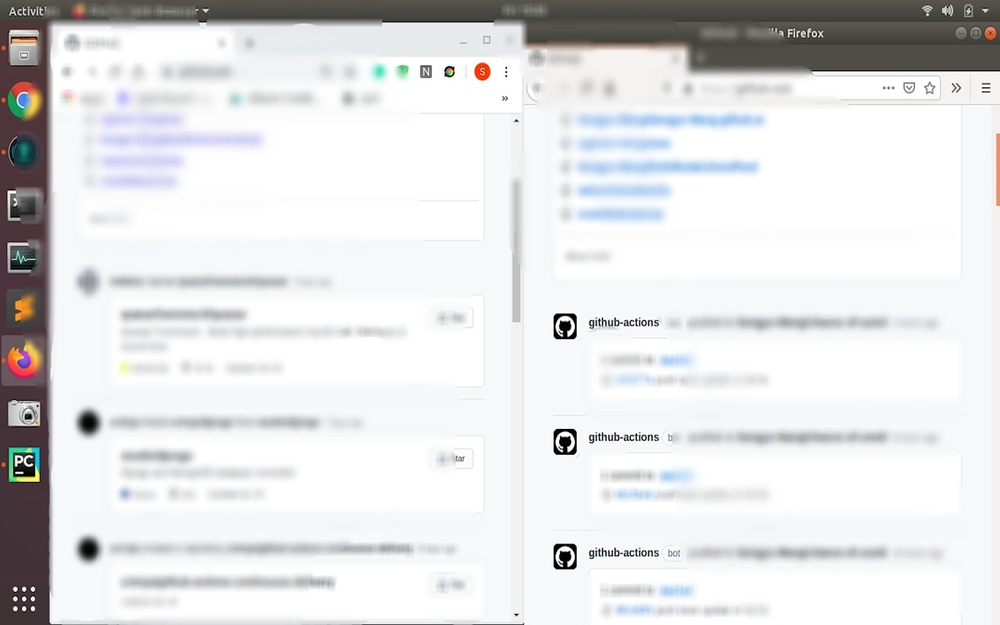

# No Github Actions Feed (Chrome extension)

Filter out all the bot feed from Github Actions on https://github.com/

Useful when you have scheduled push events in your repos

Chrome Web Store keep rejecting it with standard reply, so I am not gonna bother anymore.

If you find this extension useful, you have enough knowledge to figure out how to use it.
If you can't figure out how to use this in developer mode, I doubt you need this :)

